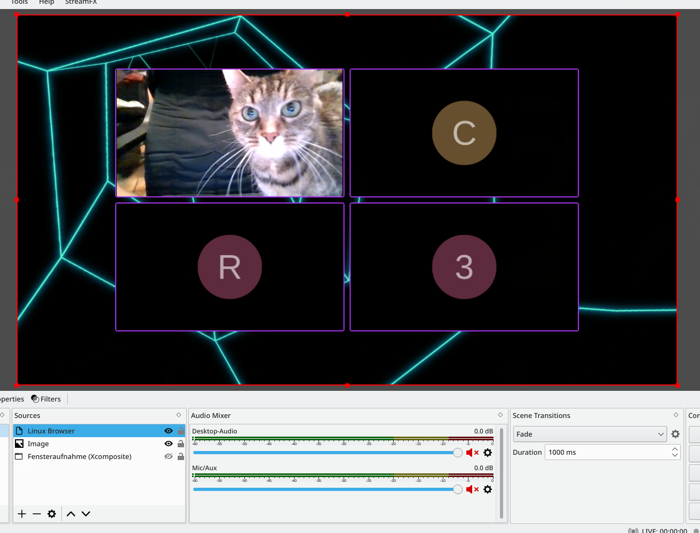
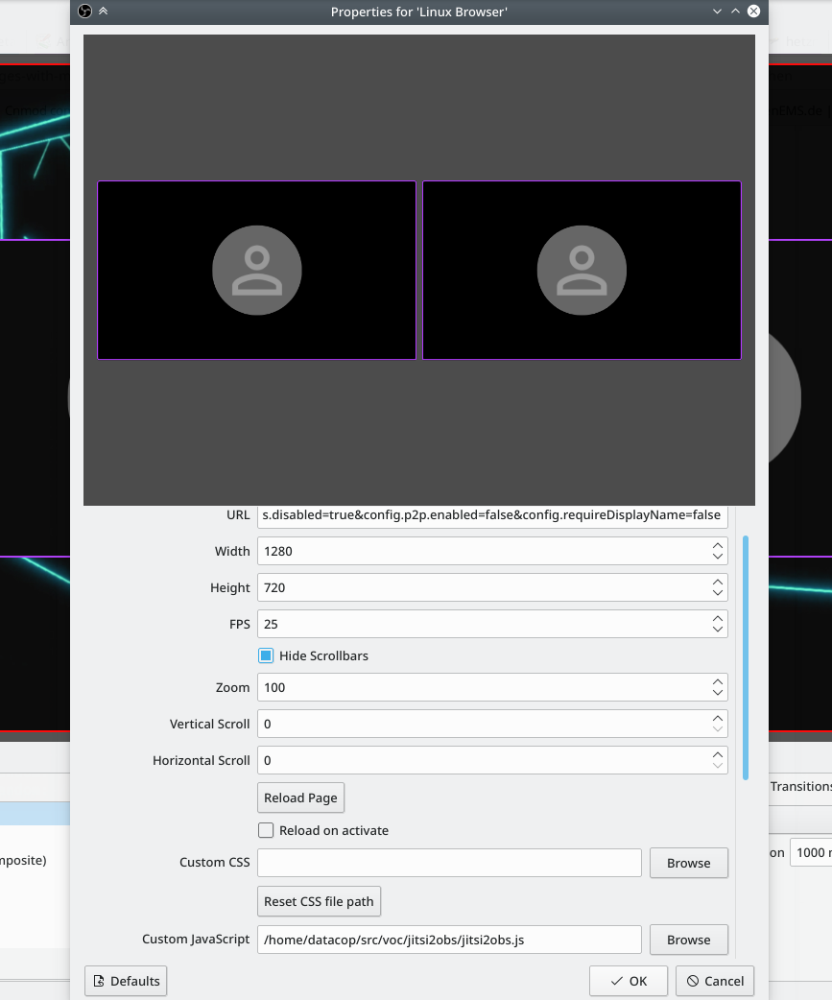

# About

This is a small JavaScript hack to adapt the Jitsi Meet UserInterface to use it in OBS Studio.

* set the background to transparent or a server-provided image
* optionally: hide non-video participans in tile view
* optionally: add border around participans


Warning: Currently, this is only tested under the obsolete `Linux Browser` OBS Plugin.

Sadly, the official `OBS Browser` plugin [still has no option](https://github.com/obsproject/obs-browser/pull/137) to add custom JS, 
but most of the settings can be set as CSS, see below.

## remote control of view

It is possible to control the speaker that's currently in view and to switch to/from tile view
by moderators by enabling `Everyone follows me` in the `More` Tab in the profile `Settings`.

## Screenshot



# Setup

* add the following to the Jitsi URL (including room name):
```
#config.iAmRecorder=true&config.externalConnectUrl=null&config.startWithAudioMuted=true&config.startWithVideoMuted=true&interfaceConfig.APP_NAME=Jibri&interfaceConfig.DISABLE_PRESENCE_STATUS=true&interfaceConfig.DISABLE_JOIN_LEAVE_NOTIFICATIONS=true&interfaceConfig.DISABLE_FOCUS_INDICATOR=true&interfaceConfig.DISABLE_DOMINANT_SPEAKER_INDICATOR=true&config.analytics.disabled=true&config.p2p.enabled=false&config.requireDisplayName=false
```

## official OBS Browser plugin

Most of the settings can be set as CSS, just add the content from **jitsi2obs.css** to your settings and edit to your liking.

## obsolete Linux Browser OBS Plugin

* edit **jitsi2obs.js** settings to your liking.
* add **jitsi2obs.js** to Custom JavaScript:



# Limitations

* if non-video participans are hidden, the size of the video-tiles are getting smaller with each additional (non-video) participant.
  we would need to hot-patch Jitsi JS to fix this.
